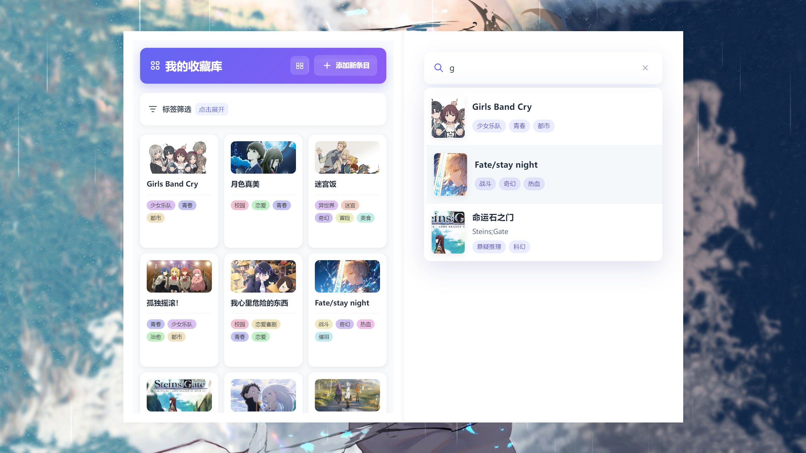
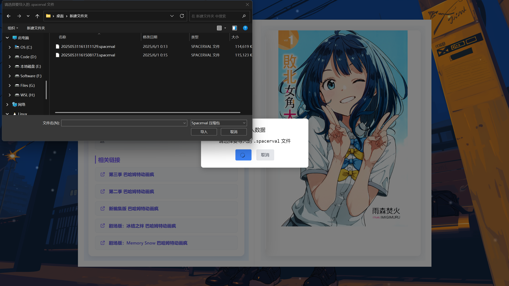

# 🎬 My Anime Gallery


[中文](README.md) | English 

✨ A beautiful anime collection management desktop application with EPUB reading, image cropping and 3D page flipping effects.


## 🌟 Features

- 📚 Anime information collection and management
- 📖 EPUB manga/novel reader
- ✂️ Image cropping and cover editing
- 🔍 Powerful search functionality
- 🖼️ 3D page flip book display
- 🌙 Dark/Light theme switching
- 💾 Local SQLite database storage
- 📦 Data import/export functionality

## 🛠️ Installation Guide

### Development Environment
```bash
# Clone repository
git clone https://github.com/SpacervalLam/My-Anime-Gallery.git

# Install dependencies
npm install

# Start development mode
npm run serve
```

### Production Build
```bash
# Build application
npm run build

# Generate installer
npm run dist
```

## 📸 Screenshots

| Feature | Screenshot |
|------|------|
| Cover Display |  |
| Detail Page |  |
| Edit Function |  |
| Gallery View |  |
| Import/Export |  |

## 💡 Usage Instructions

- Hover the mouse at the top of the screen to show the menu bar

## 🚀 Development

Tech Stack:
- Vue 3 + Vite
- Electron 25
- TypeORM + SQLite

## 📅 Project History

View [Changelog](CHANGELOG.md) for detailed update records

## 📜 License

[MIT](LICENSE) © 2025 SpacervalLam
