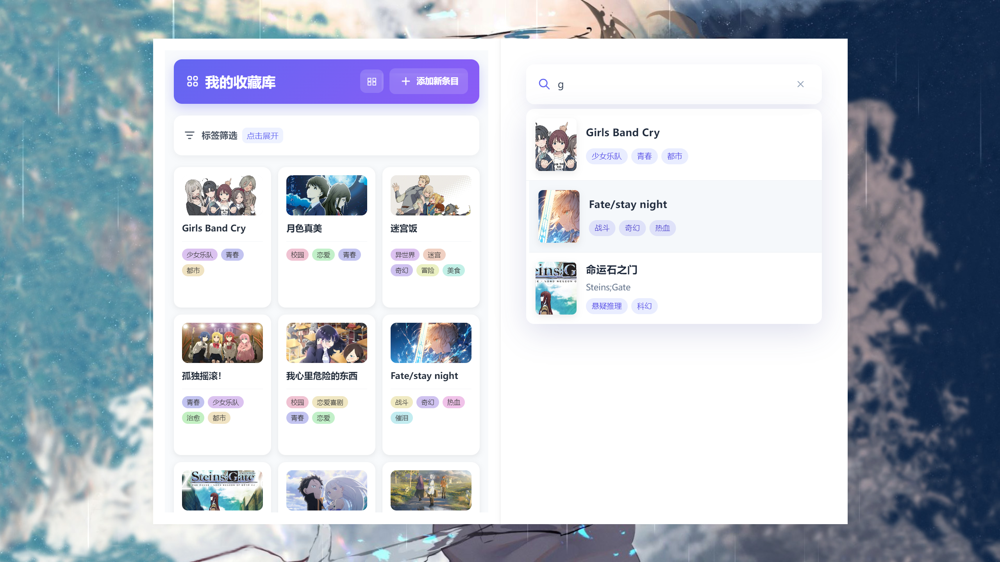
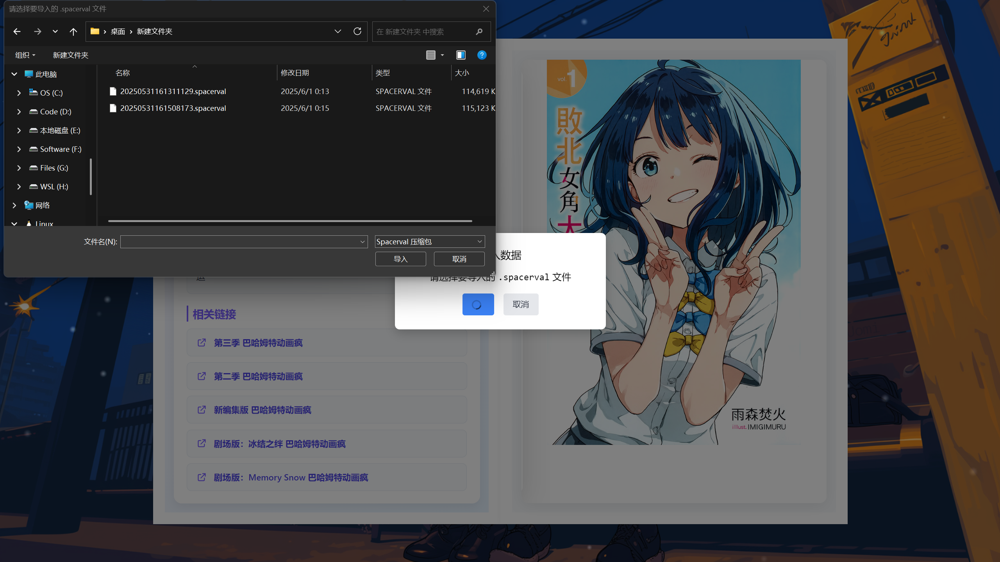

# 🎬 My Anime Gallery


中文 | [English](README.en.md)

✨ 一个精美的动漫收藏管理桌面应用，支持EPUB阅读、图片裁剪和3D翻页效果。

## 🌟 功能特性

- 📚 动漫信息收藏与管理
- 📖 EPUB漫画/小说阅读器
- ✂️ 图片裁剪与封面编辑
- 🔍 强大的搜索功能
- 🖼️ 3D翻页书效果展示
- 🌙 深色/浅色主题切换
- 💾 本地SQLite数据库存储
- 📦 数据导入/导出功能

## 🛠️ 安装指南

### 开发环境
```bash
# 克隆仓库
git clone https://github.com/SpacervalLam/My-Anime-Gallery.git

# 安装依赖
npm install

# 启动开发模式
npm run serve
```

### 生产构建
```bash
# 构建应用
npm run build

# 生成安装包
npm run dist
```

## 📸 应用截图

| 功能 | 截图 |
|------|------|
| 封面展示 |  |
| 详情页面 |  |
| 编辑功能 |  |
| 画廊视图 |  |
| 导入导出 |  |

## 🚀 开发

技术栈：
- Vue 3 + Vite
- Electron 25
- TypeORM + SQLite

## 📅 项目历史

查看[开发日志](CHANGELOG.md)了解详细更新记录

## 📜 许可证

[MIT](LICENSE) © 2025 SpacervalLam
